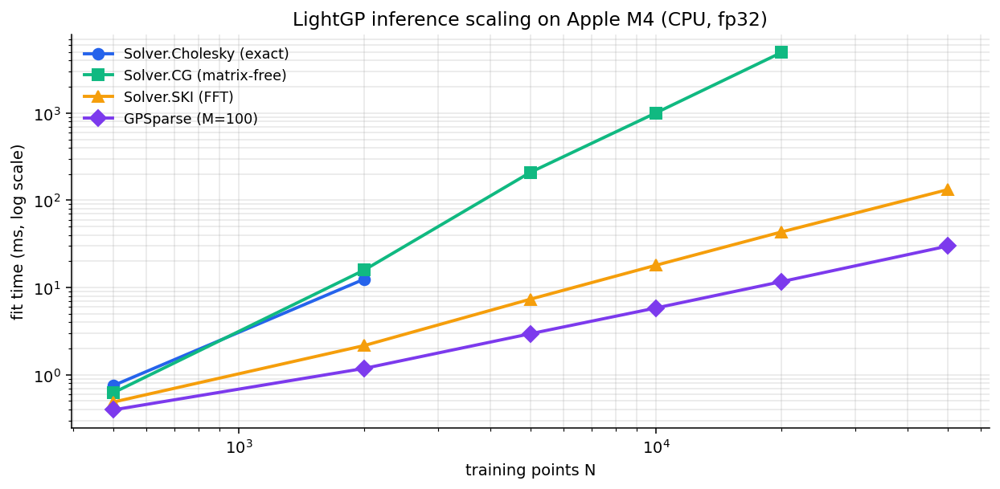

Benchmarks
==========

LightGP is benchmarked end-to-end against GPyTorch on the same hardware,
and against itself across backends. All numbers below are wall-clock
medians on Apple M4 (8 GPU cores, 16 GB unified memory), fp32, with the
local environment running ``python3.13`` + ``numpy 1.26`` + ``gpytorch
1.11`` + ``torch 2.2``.

Methodology
-----------

- Each cell is the median of 3 runs (5 for component micro-benchmarks),
  warmup discarded.
- "LightGP CPU" uses Accelerate (CBLAS + LAPACK + AMX coprocessor).
- "LightGP Metal" uses the Metal compute shaders.
- "GPyTorch MPS" uses PyTorch's Apple Silicon backend; rows marked
  *(gap)* fall back to CPU because the underlying op is missing on MPS
  (e.g. ``aten::_linalg_eigh.eigenvalues`` for exact-GP variance).

Inference scaling
-----------------

Fit-time scaling per inference method, measured on the local M4 by the
included build script (``docs/build_benchmark_figure.py``):

   Cholesky is exact and capped at N=2000 (O(N³) growth dominates).
   The matrix-free CG path scales as O(N²k); on CPU it remains
   useful up to ~20k, on Metal it reaches further. SKI and Sparse
   VFE are the long-N regimes — both still finish in tens of
   milliseconds at N=50,000.

End-to-end vs GPyTorch
----------------------

Fit + predict on synthetic ``y = sin(x)`` 1-D data:

.. list-table::
   :header-rows: 1
   :widths: 32 14 16 14 16 8

   * - Config
     - LightGP CPU
     - LightGP Metal
     - GPyTorch CPU
     - GPyTorch MPS
     - best ratio
   * - Exact RBF, N=2048, D=4
     - **23.6 ms**
     - 195 ms
     - 89 ms
     - (gap*)
     - 3.8× faster
   * - Exact Matérn-5/2, N=2048, D=4
     - **42 ms**
     - 191 ms
     - 106 ms
     - (gap*)
     - 2.5× faster
   * - Sparse RBF, N=10000, M=200
     - **18.5 ms**
     - 42 ms
     - 42 ms
     - 69 ms
     - 2.3× faster
   * - Sparse RBF, N=50000, M=200
     - **97.4 ms**
     - 156 ms
     - 196 ms
     - **98 ms**
     - 2.0× faster vs CPU; on par with MPS
   * - Matrix-free :math:`K\mathbf v`, N=20000
     - n/a
     - **22 ms**
     - n/a
     - (no equiv)
     - 32× over explicit

\*GPyTorch MPS missing op for exact-GP variance — falls back to CPU.

LightGP CPU is faster than GPyTorch CPU across the measured exact and
small-to-mid sparse configurations — same Accelerate underneath, less
Python dispatch overhead. The matrix-free :math:`K\mathbf v` path has no
GPyTorch-on-MPS equivalent.

Component micro-benchmarks
--------------------------

Cholesky factorization at increasing N, fp32:

.. list-table::
   :header-rows: 1
   :widths: 20 30 30

   * - N
     - LightGP CPU (Accelerate)
     - LightGP Metal
   * - 1024
     - 0.84 ms
     - 12.0 ms
   * - 2048
     - 4.6 ms
     - 26.0 ms
   * - 4096
     - 41.5 ms
     - 88.0 ms

Apple's AMX matrix coprocessor wins the dense Cholesky regime on Apple
Silicon. This is a hardware result, not a software gap — Metal's
integrated GPU has lower fp32 throughput than CPU+AMX at moderate N.
For dense Cholesky on Apple Silicon, ``Backend.Auto`` correctly picks
``Backend.CPU``.

Matrix-free RBF kernel-vector product on Metal vs explicit
materialization through Accelerate ``sgemm``:

.. list-table::
   :header-rows: 1
   :widths: 16 26 26 26

   * - N
     - Explicit (form K, then matmul)
     - Matrix-free (Metal)
     - Memory: explicit / free
   * - 5,000
     - 41.7 ms
     - 4 ms
     - 100 MB / 80 KB
   * - 10,000
     - 194 ms
     - 9 ms
     - 400 MB / 160 KB
   * - 20,000
     - 707 ms
     - **22 ms**
     - 1.6 GB / 320 KB

The ~32× speedup at N=20k is bandwidth-bound: explicit forms the
1.6 GB kernel matrix and streams it through ``sgemm`` once;
matrix-free fuses kernel construction and matvec into a single Metal
shader pass.

Reproducing the numbers
-----------------------

The C++ benchmark binaries live in ``benchmarks/`` and emit JSON-per-line:

.. code-block:: bash

   ./build.sh
   ./build/bench_paper > paper_results.json    # ~2 min full sweep
   ./build/bench_ski > ski_results.json         # SKI specifically
   ./build/bench_matvec > matvec_results.json   # matrix-free Kv

The Python comparison against GPyTorch:

.. code-block:: bash

   source .venv/bin/activate
   pip install torch gpytorch
   python3 benchmarks/bench_gpytorch.py > gpytorch_results.json

Both sides use identical input shapes and the same fp32 dtype, so the
numbers join cleanly on ``(method, N, M, D)``.
