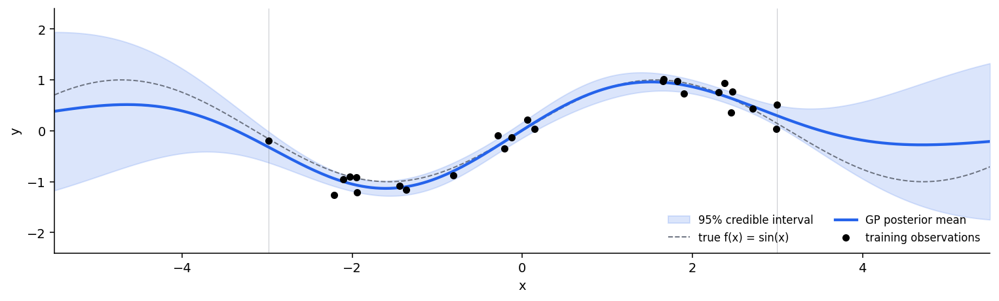

LightGP
=======

.. rst-class:: lead

   Lightweight Gaussian Process inference in C++ with Python bindings.
   Metal, CUDA, and CPU backends. Composable kernels. Zero dependencies
   beyond numpy.

   GP posterior on synthetic ``sin(x)`` data: blue mean and 95% credible band
   from :class:`lightgp.GPExact` with an :class:`lightgp.RBF` kernel.
   Uncertainty widens through the training-data gap near ``x = 1`` and
   beyond the training range — exactly what a calibrated GP should do.

.. code-block:: python

   import numpy as np
   import lightgp as gp

   X = np.linspace(-3, 3, 100, dtype=np.float32).reshape(-1, 1)
   y = np.sin(X[:, 0]).astype(np.float32) + 0.1 * np.random.randn(100).astype(np.float32)

   model = gp.GPExact(gp.Scale(gp.RBF()) + gp.Scale(gp.Periodic()))
   model.fit(X, y)
   model.optimize(steps=200)
   pred = model.predict(X)   # {'mean': array, 'var': array}

.. grid:: 3
   :gutter: 3

   .. grid-item-card:: Getting Started
      :link: getting_started/installation
      :link-type: doc

      Install LightGP and run your first GP regression in five minutes.

   .. grid-item-card:: Tutorials
      :link: tutorials/index
      :link-type: doc

      Step-by-step guides covering regression, kernel composition, sparse
      GPs, and large-scale (SKI) inference.

   .. grid-item-card:: API Reference
      :link: api/index
      :link-type: doc

      Reference for all kernels, mean functions, models, solvers, and
      backends.

Why LightGP?
------------

- **No PyTorch, no TensorFlow, no Python runtime requirement.** The core is
  dependency-free C++17. The Python layer is a thin pybind11 binding.
- **Apple Silicon-native.** Metal compute shaders and Apple Accelerate (AMX)
  for Cholesky, GEMM, and Toeplitz FFT — all auto-detected on macOS.
- **CUDA-native.** cuBLAS, cuSOLVER, cuFFT — all auto-detected on Linux+NVIDIA.
- **Three inference paths**: exact Cholesky, matrix-free CG, sparse VFE, and
  SKI (KISS-GP) for N > 100,000.
- **Composable kernels**: RBF, Matérn (½, 3/2, 5/2), Periodic, Linear, plus
  ``+``, ``*``, and ``Scale`` for arbitrary composition.
- **Honest benchmarking** against GPyTorch on the same hardware — see the
  :doc:`benchmarks <benchmarks/index>`.

Citation
--------

If you use LightGP in academic work, please cite the accompanying
`arXiv preprint <https://arxiv.org/abs/2605.17898>`_:

.. code-block:: bibtex

   @misc{fang2026lightgp,
     title         = {LightGP: Lightweight Gaussian Process Inference in C++ on Metal and CUDA},
     author        = {Yu-Hsueh Fang},
     year          = {2026},
     eprint        = {2605.17898},
     archivePrefix = {arXiv},
     primaryClass  = {cs.LG},
     doi           = {10.48550/arXiv.2605.17898},
     url           = {https://arxiv.org/abs/2605.17898}
   }

.. toctree::
   :maxdepth: 2
   :hidden:

   getting_started/installation
   getting_started/quickstart
   tutorials/index
   api/index
   benchmarks/index
   theory/index
   development/index
